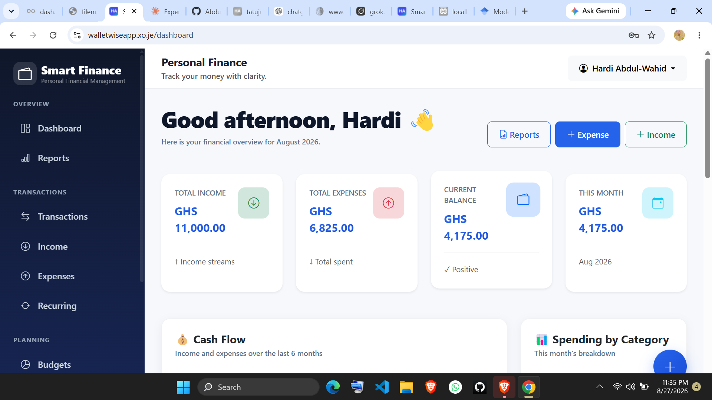
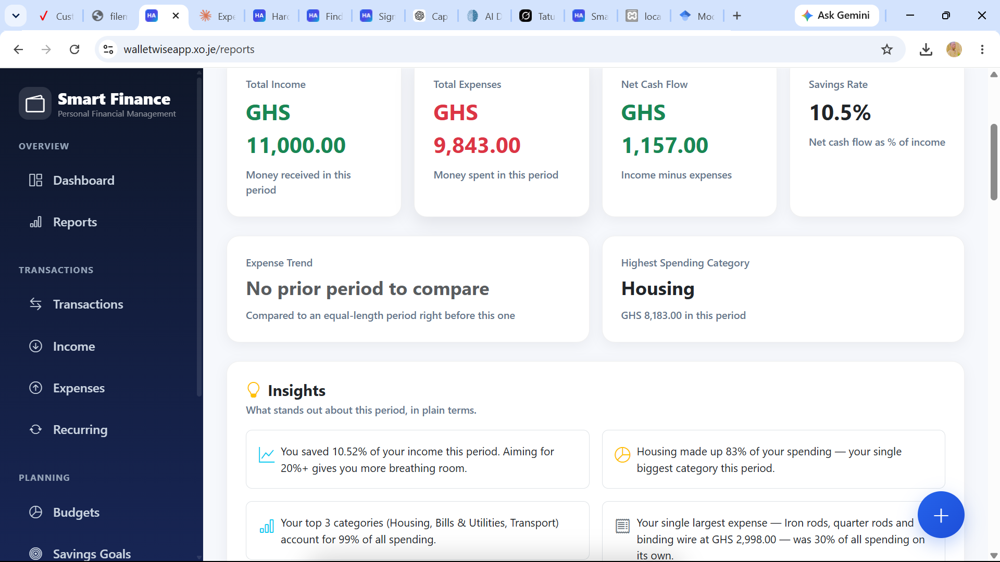
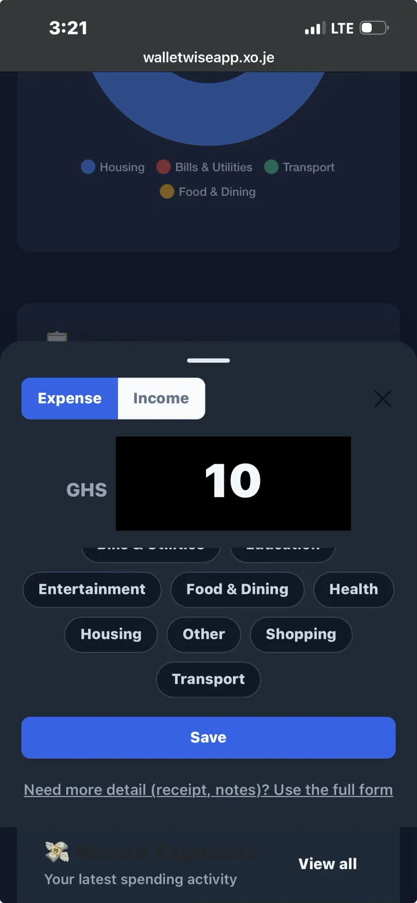

# Smart Finance

**Personal financial management, built for real life.**

Smart Finance is a personal finance manager for tracking income, expenses, budgets, and savings goals — built with Laravel and designed to be genuinely usable day to day, not just a portfolio demo.

🔗 **Live app:** [walletwiseapp.xo.je](https://walletwiseapp.xo.je)

<!-- Add 2–3 real screenshots here once you have them, e.g.:



-->

## Features

- **Income & expense tracking** — log transactions in seconds, tag by category and payment method, search and filter full history, with date-range presets (Today, This Week, This Month, etc.)
- **Budgets with real alerts** — set a spending limit per category, get notified as you approach or exceed it, and optionally have a budget repeat automatically every month
- **Savings goals** — set a target, log contributions with a quick "Add Money" action, and track progress automatically (auto-completes when the target is reached)
- **Recurring transactions** — set up bills and regular income once (rent, salary, subscriptions) and they record themselves going forward
- **Reports & insights** — monthly income vs. expenses, category breakdowns, a trailing 6-month comparison independent of any filter, and plain-language observations (e.g. "Housing made up 42% of your spending")
- **CSV and PDF export** — CSV for raw data; PDF via the browser's own print-to-PDF against a dedicated print-friendly layout (no server-side PDF library, deliberately — see [Notes on the hosting environment](#notes-on-the-hosting-environment))
- **Mobile-first quick add** — a bottom-sheet quick-add flow for logging an expense or income in a few taps, without the full multi-field form
- **Dark mode**, synced across the whole app
- **Notifications** for budget thresholds, savings-trend changes, and upcoming recurring transactions

## Tech stack

- **Backend:** Laravel 12 (PHP 8.3)
- **Frontend:** Bootstrap 5, vanilla JS, Chart.js
- **Database:** MySQL
- **Auth:** Laravel Breeze
- **Mail:** custom HTTP-API mail transport (Brevo) — see notes below on why
- **Hosting:** InfinityFree (free shared hosting)

## Getting started locally

```bash
git clone <your-repo-url>
cd smart-finance
composer install
cp .env.example .env
php artisan key:generate
```

Configure your database in `.env`, then:

```bash
php artisan migrate
php artisan storage:link
npm install && npm run build   # if you're using the Vite-based auth scaffolding assets
php artisan serve
```

Visit `http://localhost:8000`.

### Scheduled jobs

Two commands need to run daily (via `php artisan schedule:run` on a cron, or manually if you don't have cron access):

- `finance:process-recurring` — turns due recurring transactions into real expense/income records
- `finance:process-recurring-budgets` — generates the next period for any budget marked "repeat monthly"

Both also have a same-day fallback baked into the dashboard controller, throttled to once per user per day, for hosting environments where reliable cron isn't available (see below).

## Notes on the hosting environment

This app is deployed on free shared hosting (InfinityFree), which comes with some real constraints that shaped a few decisions worth explaining rather than hiding:

- **Outbound SMTP is blocked.** Mail is sent via a custom transport (`App\Mail\Transport\BrevoApiTransport`) that calls Brevo's HTTPS API directly instead of using SMTP, since HTTPS outbound is allowed where SMTP isn't.
- **No reliable cron.** Scheduled commands (recurring transactions, recurring budgets, alert checks) also run as a same-day fallback on dashboard load, throttled via cache, so the app still behaves correctly even without dependable minute-level cron.
- **No PHP `symlink()`**, which breaks Laravel's usual `storage:link` approach for serving uploaded files (e.g. receipts) on some shared hosts. Worth checking if you deploy somewhere with the same restriction.
- **PDF export uses the browser's print dialog** against a dedicated print stylesheet, rather than a server-side library like `dompdf` — those tend to be memory-heavy and a poor fit for constrained shared hosting.

## Project structure highlights

- `app/Services/FinanceCalculator.php` — single source of truth for every income/expense total, balance, and category breakdown calculation, used by the dashboard, reports, and budget logic alike
- `app/Services/FinancialInsightsService.php` — generates the plain-language report insights
- `app/Services/BudgetAlertService.php` / `InsightAlertService.php` — generate persistent notifications for budget thresholds, savings trends, and upcoming recurring items
- `app/Console/Commands/ProcessRecurringTransactions.php` / `ProcessRecurringBudgets.php` — the recurring-generation logic described above

## Roadmap / not yet built

- Receipt OCR
- Admin panel
- PWA / offline support
- Multi-language support

## Author

Built by [Abdul-Wahidu](https://github.com/Abdul19Wahid) — [LinkedIn](https://linkedin.com/in/abdul-wahid-955405403)
